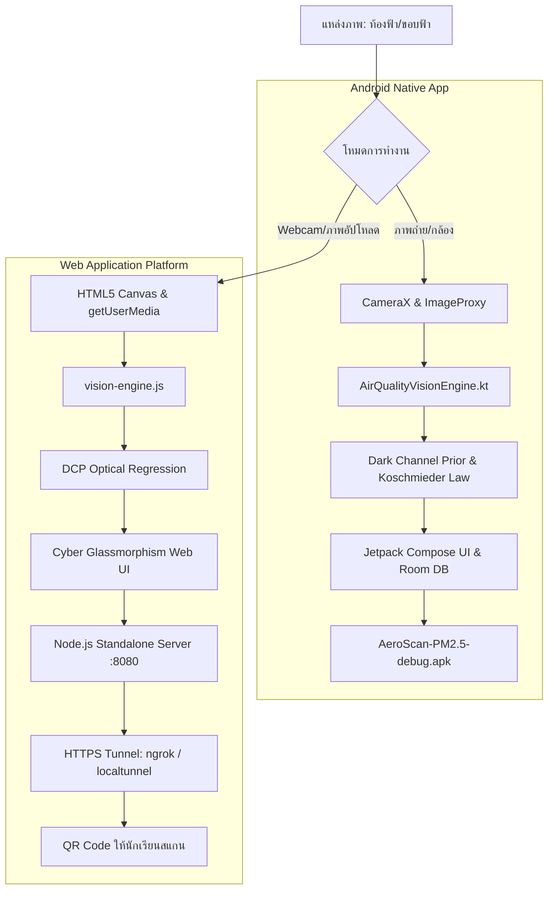

# คู่มือการพัฒนาและชุดพรอมพ์สร้างแอปพลิเคชัน AeroScan PM2.5 🛰️
**Comprehensive Developer Guide & Prompt Engineering Playbook for AI Atmospheric Vision Application**

---

## 📑 สารบัญ (Table of Contents)

1. [ภาพรวมสถาปัตยกรรมระบบ (System Architecture Overview)](#1-ภาพรวมสถาปัตยกรรมระบบ)
2. [ทฤษฎีฟิสิกส์บรรยากาศและ AI คอมพิวเตอร์วิทัศน์ (Atmospheric Physics & AI Vision)](#2-ทฤษฎีฟิสิกส์บรรยากาศและ-ai-คอมพิวเตอร์วิทัศน์)
3. [คู่มือการพัฒนาแอปพลิเคชัน Android (Android Developer Guide)](#3-คู่มือการพัฒนาแอปพลิเคชัน-android)
4. [คู่มือการพัฒนาระบบ Web Server & Web Application](#4-คู่มือการพัฒนาระบบ-web-server--web-application)
5. [การแก้ปัญหา In-App Browser และสิทธิ์กล้อง (LINE & Mobile Compatibility)](#5-การแก้ปัญหา-in-app-browser-และสิทธิ์กล้อง)
6. [คู่มือวิศวกรรมพรอมพ์ (Prompt Engineering Playbook)](#6-คู่มือวิศวกรรมพรอมพ์-สร้างแอปพลิเคชันตั้งแต่เริ่มต้น)
7. [คลังพรอมพ์มาตรฐานระดับ Masterclass (Master Prompt Templates)](#7-คลังพรอมพ์มาตรฐานระดับ-masterclass)

---

## 1. ภาพรวมสถาปัตยกรรมระบบ

AeroScan PM2.5 ได้รับการออกแบบภายใต้สถาปัตยกรรม **Dual-Platform Architecture (Android Native + Standalone Web)** เพื่อตอบสนองการใช้งานแบบออฟไลน์ 100% บนสมาร์ตโฟน และการเข้าถึงแบบทันทีผ่านเว็บเบราว์เซอร์ด้วย QR Code



---

## 2. ทฤษฎีฟิสิกส์บรรยากาศและ AI คอมพิวเตอร์วิทัศน์

หัวใจสำคัญของ AeroScan PM2.5 คือการประเมินความเข้มข้นของฝุ่นละอองอนุภาคขนาดเล็ก ($\le 2.5\ \mu\text{m}$) โดยไม่ต้องพึ่งพาเซนเซอร์ฮาร์ดแวร์ภายนอก แต่ใช้คุณสมบัติการกระเจิงแสงในชั้นบรรยากาศ (Atmospheric Scattering)

### 2.1 Dark Channel Prior (DCP)
คิดค้นโดย He et al. โดยตั้งข้อสังเกตว่าในภาพถ่ายกลางแจ้งที่ไม่มีหมอกควัน พิกเซลส่วนใหญ่ในบริเวณที่ไม่ใช่ท้องฟ้าจะมีช่องสีอย่างน้อยหนึ่งช่อง (R, G หรือ B) ที่มีค่าความเข้มแสงต่ำมากจนเกือบเป็นศูนย์:

$$J^{dark}(x) = \min_{y \in \Omega(x)} \left( \min_{c \in \{r,g,b\}} I^c(y) \right) \approx 0$$

เมื่อมีฝุ่นละออง PM2.5 และหมอกควันสะสม แสงสะท้อนจากชั้นบรรยากาศ (Airlight, $A$) จะกระเจิงเข้ามาแทนที่ ทำให้ค่า Dark Channel สูงขึ้นแปรผันตรงกับความหนาแน่นของฝุ่น

### 2.2 กฎของคอชมิเดอร์ (Koschmieder's Law)
ความสัมพันธ์ระหว่างความโปร่งแสงของบรรยากาศ ($t$) กับสัมประสิทธิ์การสูญพันธุ์ของแสง ($\beta_{ext}$):

$$t(x) = e^{-\beta_{ext} \cdot d(x)}$$

โดยในระบบเราประมาณการค่าการส่องผ่านแสงของบรรยากาศ ($t$) จาก:

$$t = 1 - \omega \cdot \left( \frac{\text{meanDarkChannel}}{A} \right)$$

* $\omega = 0.95$ (ปัจจัยรักษาความเป็นธรรมชาติของชั้นบรรยากาศ)
* $A$ = ความสว่างของแสงบรรยากาศ (Airlight $\approx 0.75 - 1.0$)
* สัมประสิทธิ์การสูญพันธุ์ $\beta_{ext} = -\frac{\ln(t)}{d_{eff}}$ (โดยกำหนดระยะทางอ้างอิงขอบฟ้าเฉลี่ย $d_{eff} = 5.0\text{ km}$)

### 2.3 การลดทอนความเปรียบต่างและขอบภาพ (Sobel Edge Energy & Contrast Attenuation)
เมื่อฝุ่นหนาทึบ รายละเอียดความถี่สูง (High-frequency edges) และ Contrast ของภาพจะถูกกลืนหายไป ระบบใช้ฟิลเตอร์ Sobel $3 \times 3$ คำนวณความแปรปรวนของขอบภาพ:

$$G_x = \begin{bmatrix} -1 & 0 & 1 \\ -2 & 0 & 2 \\ -1 & 0 & 1 \end{bmatrix} * I, \quad G_y = \begin{bmatrix} -1 & -2 & -1 \\ 0 & 0 & 0 \\ 1 & 2 & 1 \end{bmatrix} * I$$

$$E_{edge} = \frac{1}{N} \sum \sqrt{G_x^2 + G_y^2}$$

### 2.4 สมการถดถอยพหุคูณประเมินค่า PM2.5 (Multi-Feature Regression)
$$\text{PM2.5} = w_1 \cdot (110 \cdot \text{Dark}^{1.25}) + w_2 \cdot (160 \cdot \beta^{1.15}) + w_3 \cdot (1 - \text{Contrast}) + w_4 \cdot (1 - E_{edge}) + w_5 \cdot (1 - \text{Sat})$$

*(โดยปรับเทียบตามเกณฑ์มาตรฐานสถานีตรวจวัดคุณภาพอากาศของกรมควบคุมมลพิษ)*

---

## 3. คู่มือการพัฒนาแอปพลิเคชัน Android

### 3.1 ข้อกำหนดสภาพแวดล้อม (Prerequisites)
* **JDK**: OpenJDK 17 (`/opt/homebrew/opt/openjdk@17`)
* **Android SDK**: API Level 36 (`compileSdk = 36`, `targetSdk = 36`, `minSdk = 24`)
* **Gradle**: เวอร์ชัน 9.3.1 (Kotlin DSL)
* **Libraries**: Jetpack Compose BOM, CameraX, Room Database, KSP, Material3

### 3.2 การสร้าง Keystore สำหรับ Build Debug
```bash
keytool -genkey -v -keystore ./debug.keystore \
  -storepass android -alias androiddebugkey -keypass android \
  -keyalg RSA -keysize 2048 -validity 10000 \
  -dname "CN=Android Debug,O=Android,C=US"
```

### 3.3 การคอมไพล์และสร้าง APK (Build APK)
```bash
# กำหนด Path ของ Android SDK ใน local.properties
echo "sdk.dir=$HOME/Library/Android/sdk" > local.properties

# สั่งคอมไพล์สร้าง APK
JAVA_HOME=/opt/homebrew/opt/openjdk@17 ./gradlew assembleDebug

# ผลลัพธ์ APK จะอยู่ที่:
# app/build/outputs/apk/debug/app-debug.apk
```

---

## 4. คู่มือการพัฒนาระบบ Web Server & Web Application

### 4.1 สถาปัตยกรรม Zero-Dependency Node.js Server (`server.js`)
เราสร้าง HTTP Server ด้วยโมดูลมาตรฐานของ Node.js (`http`, `fs`, `path`, `os`) โดยไม่ต้องสั่ง `npm install` ใดๆ ทำให้สามารถเปิดรันได้ทันทีทุกสภาพแวดล้อม:

```javascript
// ตัวอย่างการทำงานหลักใน server.js
const http = require('http');
const fs = require('fs');
const path = require('path');

const PORT = process.env.PORT || 8080;
const server = http.createServer((req, res) => {
  if (req.url === '/download/apk') {
    const apkFile = path.join(__dirname, 'AeroScan-PM2.5-debug.apk');
    res.writeHead(200, {
      'Content-Type': 'application/vnd.android.package-archive',
      'Content-Disposition': 'attachment; filename="AeroScan-PM2.5-debug.apk"'
    });
    fs.createReadStream(apkFile).pipe(res);
    return;
  }
  // Static file serving สำหรับโฟลเดอร์ public/...
});
server.listen(PORT, '0.0.0.0');
```

### 4.2 การรัน Web Server
```bash
# คำสั่งรัน Server
node server.js
# หรือ
npm start
```

---

## 5. การแก้ปัญหา In-App Browser และสิทธิ์กล้อง

### 5.1 ปัญหาของ LINE In-App Browser
เมื่อผู้ใช้สแกน QR Code จากแอปพลิเคชัน LINE หน้าเว็บจะถูกเปิดภายใน **In-App Browser ของ LINE** ซึ่งมีนโยบายความปลอดภัยเข้มงวด:
* บล็อกคำสั่ง `navigator.mediaDevices.getUserMedia`
* ไม่แสดงหน้าต่างขออนุญาตเปิดกล้อง ทำให้กล้องสแกนสดใช้งานไม่ได้

### 5.2 วิธีแก้ปัญหาแบบอัตโนมัติ (Automated Solution)
เติม Query Parameter: **`?openExternalBrowser=1`** เข้าไปใน URL ของระบบ:

```
https://dairy-faster-perjurer.ngrok-free.dev/?openExternalBrowser=1
```

* เมื่อแอป LINE สแกนหรือเปิดลิงก์ที่มีพารามิเตอร์นี้ LINE จะ **ปิด In-App Browser ของตนเอง แล้วเปิดด้วยเบราว์เซอร์หลักของระบบ (Safari บน iOS หรือ Chrome บน Android) โดยอัตโนมัติทันที**
* เมื่อเปิดบน Safari / Chrome ระบบความปลอดภัยจะอนุญาตให้ขอสิทธิ์เปิดกล้องได้ตามปกติ 100%

### 5.3 โค้ดตรวจจับและป้องกันภายใน `app.js`
```javascript
const isLineBrowser = /Line\//i.test(navigator.userAgent) || /Line/i.test(navigator.userAgent);

// หากหลุดเข้ามาใน LINE โดยไม่มีพารามิเตอร์ ให้ดีดออกไปเบราว์เซอร์หลัก
if (isLineBrowser && !window.location.search.includes('openExternalBrowser=1')) {
  const sep = window.location.href.includes('?') ? '&' : '?';
  window.location.replace(window.location.href + sep + 'openExternalBrowser=1');
}
```

---

## 6. คู่มือวิศวกรรมพรอมพ์ (Prompt Engineering Playbook)

ในการสั่งการ AI (เช่น Antigravity, Claude 3.7, Gemini 2.0 Flash) ให้พัฒนาแอปพลิเคชันระดับ Production-Ready ควรใช้กรอบการทำงานแบบ **CLEAR Framework**:

1. **C - Context (บริบท)**: ระบุบทบาท เทคโนโลยี และข้อจำกัดของระบบให้ชัดเจน
2. **L - Logic & Math (ทฤษฎีและตรรกะ)**: กำหนดสูตรการคำนวณและขั้นตอนอัลกอริทึม
3. **E - Execution (การลงมือทำ)**: ระบุโครงสร้างไฟล์ รหัสภาษา และมาตรฐานโค้ด
4. **A - Aesthetics & UX (ความสวยงามและประสบการณ์ใช้งาน)**: บังคับใช้สี ฟอนต์ แอนิเมชัน และ Responsive Design
5. **R - Robustness (ความเสถียรและการตรวจสอบ)**: การดักจับ Error และการทดสอบ

---

## 7. คลังพรอมพ์มาตรฐานระดับ Masterclass

### พรอมพ์ชุดที่ 1: ออกแบบอัลกอริทึม AI Vision & ฟิสิกส์บรรยากาศ
```markdown
คุณคือ Senior Computer Vision & Atmospheric Physics Engineer 
จงพัฒนาอัลกอริทึมประมาณการค่าฝุ่นละออง PM2.5 (µg/m³) และคำนวณดัชนี AQI จากภาพถ่ายขอบฟ้า/ท้องฟ้า ด้วยภาษา JavaScript (Canvas API) และ Kotlin:

ข้อกำหนดทางเทคนิค:
1. ใช้ทฤษฎี Dark Channel Prior (DCP): คำนวณ min(R, G, B) บนตารางพิกเซลมาตรฐานขนาด 160x120
2. ใช้กฎของคอชมิเดอร์ (Koschmieder's Law): คำนวณค่า Optical Transmission (t) และ Extinction Coefficient (beta) 
3. คำนวณ Sobel Filter 3x3 เพื่อหา Contrast Variance และ Edge Energy
4. สร้างสมการถดถอยคำนวณค่า PM2.5 ที่ให้ผลลัพธ์ระหว่าง 0 - 300 µg/m³
5. แปลงค่า PM2.5 เป็น AQI ตามเกณฑ์มาตรฐานกรมควบคุมมลพิษ (PCD) และ US EPA
6. ส่งออกค่า Telemetry: Haze Density Index (%), Transmission (t), Extinction Coeff (km⁻¹), และ AI Confidence Score (%)
```

### พรอมพ์ชุดที่ 2: สร้าง Web Server แบบ Zero-Dependency
```markdown
คุณคือ Principal Backend Architect
จงสร้างไฟล์ `server.js` บนสภาพแวดล้อม Node.js โดยมีข้อกำหนดห้ามใช้ไลบรารีภายนอก (Zero external npm dependencies):

ความสามารถที่ต้องการ:
1. ใช้เฉพาะโมดูล native ของ Node.js: http, fs, path, os, url
2. ให้บริการไฟล์สถิต (Static Assets) จากโฟลเดอร์ /public พร้อมระบุ Content-Type MIME ให้ถูกต้อง (.html, .css, .js, .svg, .png, .apk)
3. มี Route `/download/apk` สำหรับดาวน์โหลดไฟล์ Android APK พร้อมแนบ Header Content-Disposition ให้ถูกต้อง
4. มี Route `/api/status` ส่งออกข้อมูลสถานะเซิร์ฟเวอร์ ขนาดไฟล์ APK และรายการ Local IP Addresses
5. ตรวจหา IP ของเครื่องในวง LAN อัตโนมัติ และพิมพ์แสดงผล URL สำหรับเปิดบนมือถือเมื่อเซิร์ฟเวอร์เริ่มทำงาน
```

### พรอมพ์ชุดที่ 3: ออกแบบหน้าเว็บสไตล์ Cyber Glassmorphism & Mobile Responsive
```markdown
คุณคือ Award-Winning UI/UX Designer & Frontend Engineer
จงออกแบบและเขียนโค้ด `index.html` และ `styles.css` สำหรับแอป AeroScan PM2.5 ให้มีสไตล์ Ultra-Modern Dark Glassmorphism:

ข้อกำหนดด้านความสวยงามและ UX:
1. ธีมสี: Deep Obsidian Slate (#060913) ผสานแสงเรือง Ambient Glow ที่เปลี่ยนสีตามระดับ AQI อัตโนมัติ
2. ฟอนต์: ใช้ Google Fonts ได้แก่ Outfit (สำหรับตัวเลขและหัวข้อ), Plus Jakarta Sans (เนื้อหา), และ JetBrains Mono (ตัวเลขโค้ด)
3. Responsive สมบูรณ์แบบ 100%: รองรับตั้งแต่สมาร์ตโฟนหน้าจอแคบ (320px) จนถึงจอ 4K ไม่มีส่วนล้นขอบแนวนอน
4. รองรับ Safe Area Inset ของ iPhone (Notch & Home Bar)
5. องค์ประกอบหน้าจอ:
   - Header พร้อมระบุพิกัด GPS, ปุ่ม QR Code นักเรียน, และปุ่มดาวน์โหลด APK
   - Segmented Tab Navigation สลับระหว่าง: สแกนภาพถ่าย, กล้องสแกนสด HUD, และสถิติย้อนหลัง
   - มาตรวัดเข็ม Semi-Circle SVG Radial Gauge พร้อมแอนิเมชัน Count-up ตัวเลข
   - การ์ดมาตรวัดฟิสิกส์บรรยากาศ (Haze, Extinction, Transmission, Contrast)
   - การ์ดคำแนะนำสุขภาพ (หน้ากาก N95, กิจกรรมกลางแจ้ง, กลุ่มเสี่ยง, เครื่องฟอกอากาศ)
```

### พรอมพ์ชุดที่ 4: การแก้ปัญหา LINE In-App Browser และสิทธิ์กล้องบนมือถือ
```markdown
จงปรับปรุงระบบเว็บ AeroScan PM2.5 ให้สามารถเปิดกล้องสดบนสมาร์ตโฟนได้อย่างสมบูรณ์ โดยเฉพาะเมื่อสแกนผ่านแอป LINE:

สิ่งที่ต้องทำ:
1. วิเคราะห์สาเหตุที่ LINE In-App Browser บล็อกการใช้งาน `getUserMedia`
2. แก้ไขระบบสร้าง QR Code ให้ฝังพารามิเตอร์ `?openExternalBrowser=1` เพื่อบังคับให้ LINE สลับไปเปิดบน Safari / Chrome อัตโนมัติ
3. เขียนโค้ดใน JavaScript ตรวจสอบ User-Agent ของ LINE: หากพบว่าเปิดค้างอยู่ใน LINE ให้ดีดออกไปเบราว์เซอร์หลัก หรือแสดงหน้าต่างแนะนำวิธีแตะปุ่ม 3 จุด (⋮ / ⋯) เพื่อเลือก "เปิดในเบราว์เซอร์อื่น"
```

### พรอมพ์ชุดที่ 5: คอมไพล์และ Build APK สำหรับ Android
```markdown
คุณคือ Android Build Engineer
โปรเจกต์นี้เป็น Android Kotlin DSL กรุณาตรวจสอบสภาพแวดล้อมและรันคำสั่งคอมไพล์ APK:

ขั้นตอนที่ต้องดำเนินการ:
1. ตรวจสอบ JDK และกำหนด JAVA_HOME ชี้ไปที่ OpenJDK 17
2. ตรวจสอบและสร้าง local.properties ระบุ `sdk.dir` ชี้ไปยัง Android SDK บนเครื่อง
3. ตรวจสอบ Keystore หากยังไม่มี ให้ใช้คำสั่ง keytool สร้าง `debug.keystore` พร้อมรหัสผ่าน android
4. สร้าง Wrapper gradlew หากยังไม่มี
5. สั่งรัน `./gradlew assembleDebug` และคัดลอกผลลัพธ์ APK มาไว้ที่โฟลเดอร์หลักของโปรเจกต์
```

---

## 8. สรุปภาพรวมและแนวทางการนำไปต่อยอด

คู่มือฉบับนี้รวบรวมทั้ง **องค์ความรู้ทางวิชาการฟิสิกส์บรรยากาศ**, **ขั้นตอนการวิศวกรรมระบบซอฟต์แวร์แบบ Dual-Platform**, และ **ชุดคำสั่งพรอมพ์มาตรฐาน** เพื่อให้ครู ผู้สอน นักพัฒนา หรือนักเรียน สามารถนำสถาปัตยกรรมนี้ไปประยุกต์ใช้ในการสร้างแอปพลิเคชันตรวจวัดสิ่งแวดล้อม หรือโครงงานวิทยาศาสตร์คอมพิวเตอร์ระดับสูงได้อย่างมีประสิทธิภาพสูงสุดครับ 🛰️🌱
